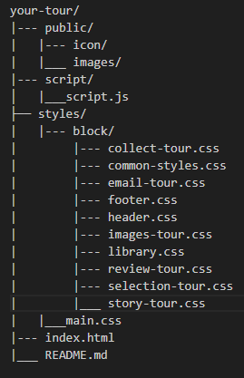

# YourTour - сайт для выбора путешествий
[YourTour](https://your-tour-six.vercel.app/)

## Возможности
- адаптивный дизайн
- форма для поиска туров с проверкой
- плавная навигация

## Системные требования
- Веб-браузер: Edge, Chrome и др.
- Интернет-соединение должно быть стабильным и быстрым
- Разрешение экрана от 320px и выше

## Установка и настройка
1. Скачайте файлы проекта из репозитория
2. Распакуйте файлы
3. Откройте `index.html` в браузере

# Управление сайтом
## Основные разделы
1. `Шапка` - логотип, меню, телефон, главный заголовок с кнопкой
2. `Выбери свой тур` - навигация, карточки туров с ценами, фото и кнопкой
3. `Собери свой тур` - форма для ввода данных и поиска тура
4. `Отзывы путешественников` - отображение отзывов
5. `Фотографии путешествий` - галерея фотографий
6. `Истории путешествий` - истории путешествий с соцсетями
7. `Связь с нами` - email для связи
8. `Футер` - ссылки на соцсети (telegram, facebook, VK)

## Файловая структура проекта

